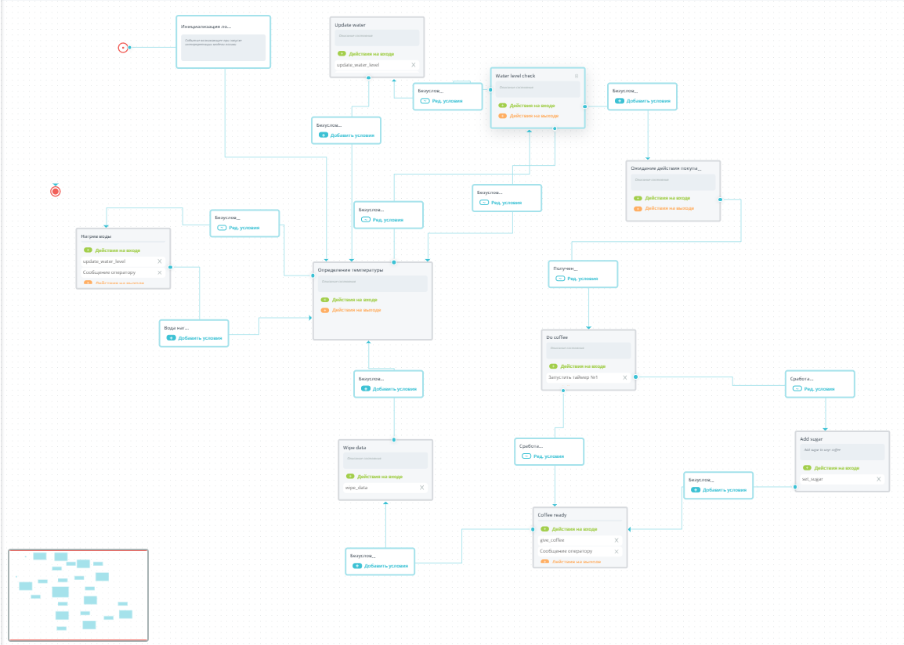

### Задание 
1) Придумать IoT кейс
2) Обеспечить получение данных более чем по 4 параметрам. Для эмулирования данных использовать бота.
3) Реализовать обработчик параметров, получить с помощью него одно или более выходных значений.
4) Реализовать автомат, использующий 

- как минимум один переход по срабатыванию таймера, 
- как минимум один переход по событию получения данных
- как минимум одно PUSH-уведомление в одном из состояний.

## Работа
### Кейс
Автомат выдающий кофе. Пользователь подходит вносит данные получет коффе и уходит. Автомат также мониторит уровень воды и ее нагрев.

### Данные 
|Название           |Измерение               |Описание         |Топик                            |
|---------------------|------------------------|-----------------|---------------------------------|
|<b>water_level</b>   |Int                     |Количество воды в автомате(литры)|/system/water|
|<b>temperature</b>   |Int                     |Температура воды (&#176;С)|/system/temperature      |
|<b>drink_type</b>    |Int                     |Код кофе - число более единыцы. 0 - null|/user/drink_type|
|<b>system_money</b>  |Int                     |Количество денег в системе|/system/money|
|<b>user_money</b>    |Int                     |Количество денег внесенных пользователем|/user/money|
|<b>sugar</b>         |Boolean                 |Добавлять ли сахар |/user/sugar|

### Команды
|Название           |Описание         |Топик                            |
|---------------------|-----------------|---------------------------------|
|<b>give_coffee</b>   |Выдача коффе пользователю|/user/give_coffee|
|<b>set_sugar</b>      Добавление сахара|/user/add_sugar|
|<b>update_water_level</b>    |Долить в автомат воды|system/update_water|
|<b>wipe_data</b>    |Удалить данные пользователя (внесенные деньги, выбранные напитки, сахар)|/system/wipe_data|

### Обработчик
Обрабатывает тип напитка. Предпологается, что напитка 2 типа. При подаче других данных в поле <b>drink_type</b> будет установлен 0

### Переходы
#### По получению данных 
- При ожидании действия покупателя
#### По срабатыванию таймера
- Состояние <i>Do coffee</i> при "варке" кофе

### PUSH-уведомления
- Нагрев воды
- Кончилась вода
- Выдан кофе

### Скриншот

