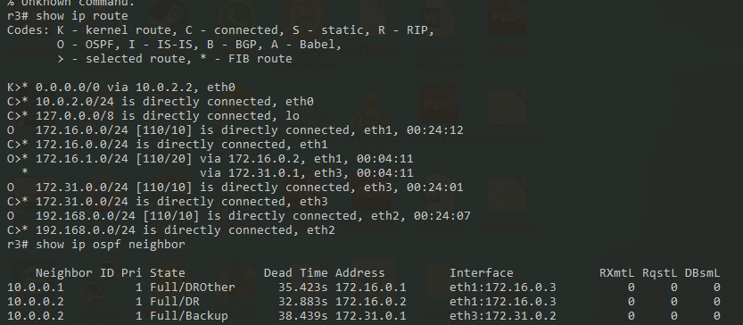
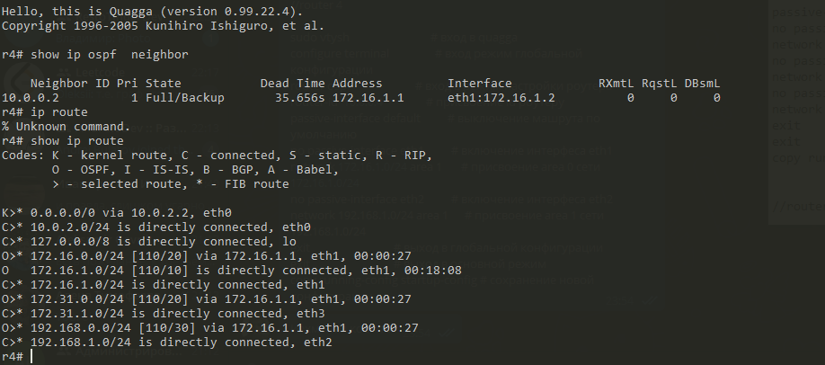

# Лабораторная работа 2
### Настройка на все роутеры
```

cat /proc/sys/net/ipv4/ip_forward
sudo bash -c 'echo 1 > /proc/sys/net/ipv4/ip_forward'
sudo yum install nano -y
sudo nano /etc/sysctl.d/router.conf

net.ipv4.ip_forward = 1
net.ipv4.conf.all.forwarding = 1
net.ipv4.conf.all.rp_filter = 2


sudo yum install quagga -y
sudo touch /etc/quagga/ospfd.conf
sudo chown quagga:quagga /etc/quagga/ospfd.conf && sudo chmod 640 /etc/quagga/ospfd.conf

sudo systemctl enable zebra
sudo systemctl enable ospfd
sudo systemctl start zebra
sudo systemctl start ospfd

systemctl status firewalld
sudo systemctl start firewalld
sudo firewall-cmd --add-protocol=ospf --permanent
sudo firewall-cmd --reload
sudo firewall-cmd --list-all
```
### Router 1
```
sudo vtysh                    # вход в quagga
configure terminal            # вход режим глобальной конфигурации
router ospf                   # вход в режим настройки роутера
router-id  10.0.0.1           # присвоение id роутеру
passive-interface default     # выключение машрута по умолчанию
network 172.16.0.0/24 area 0  # присвоение area 0 сети 172.16.0.0/24
no passive-interface eth1     # включение интерфеса eth1
default-information originate # включение распространения маршрута по умолчанию
exit                          # выход в глобальной конфигурации
exit                          # выход в основной режим
copy running-config startup-config # сохранение новой конфигурации
exit                          # выход в консоль
sudo iptables -t nat -A POSTROUTING -o eth1 -j MASQUERADE  # включение маскарада на интерфейсе eth1
```


### Router 2
```
sudo vtysh                    # вход в quagga
configure terminal            # вход режим глобальной конфигурации
router ospf                   # вход в режим настройки роутера
router-id  10.0.0.2           # присвоение id роутеру
passive-interface default     # выключение машрута по умолчанию
no passive-interface eth1     # включение интерфеса eth1
network 172.16.0.0/24 area 0  # присвоение area 0 сети 172.16.0.0/24
no passive-interface eth2     # включение интерфеса eth2
network 172.16.1.0/24 area 1  # присвоение area 1 сети 172.16.1.0/24
no passive-interface eth3     # включение интерфеса eth3
network 172.31.0.0/24 area 0  # присвоение area 0 сети 172.31.0.0/24
exit                          # выход в глобальной конфигурации
exit                          # выход в основной режим
copy running-config startup-config # сохранение новой конфигурации
```

### Router 3
```
sudo vtysh                     # вход в quagga
configure terminal             # вход режим глобальной конфигурации
router ospf                    # вход в режим настройки роутера
router-id  10.0.0.3            # присвоение id роутеру
passive-interface default      # выключение машрута по умолчанию
no passive-interface eth1      # включение интерфеса eth1
network 172.16.0.0/24 area 0   # присвоение area 0 сети 172.16.0.0/24
no passive-interface eth2      # включение интерфеса eth2
network 192.168.0.0/24 area 0  # присвоение area 1 сети 192.168.0.0/24
no passive-interface eth3      # включение интерфеса eth3
network 172.31.0.0/24 area 0   # присвоение area 0 сети 172.31.0.0/24
exit                           # выход в глобальной конфигурации
exit                           # выход в основной режим
copy running-config startup-config # сохранение новой конфигурации
```

### Router 4
```
sudo vtysh                              # вход в quagga
configure terminal                 # вход режим глобальной конфигурации
router ospf                        # вход в режим настройки роутера
router-id  10.0.0.4                # присвоение id роутеру
passive-interface default          # выключение машрута по умолчанию
no passive-interface eth1          # включение интерфеса eth1
network 172.16.1.0/24 area 1       # присвоение area 0 сети 172.16.1.0/24
no passive-interface eth2          # включение интерфеса eth2
network 192.168.1.0/24 area 1      # присвоение area 1 сети 192.168.1.0/24
exit                               # выход в глобальной конфигурации
exit                               # выход в основной режим
copy running-config startup-config # сохранение новой конфигурации
```
