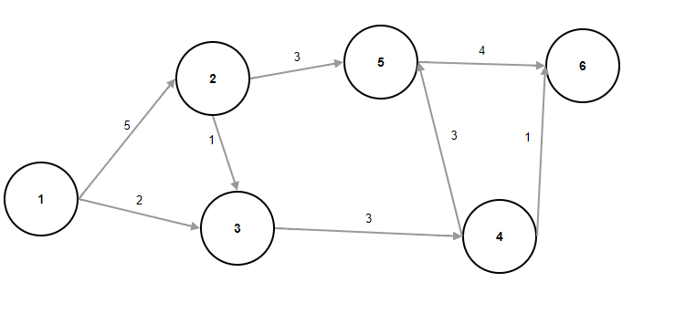
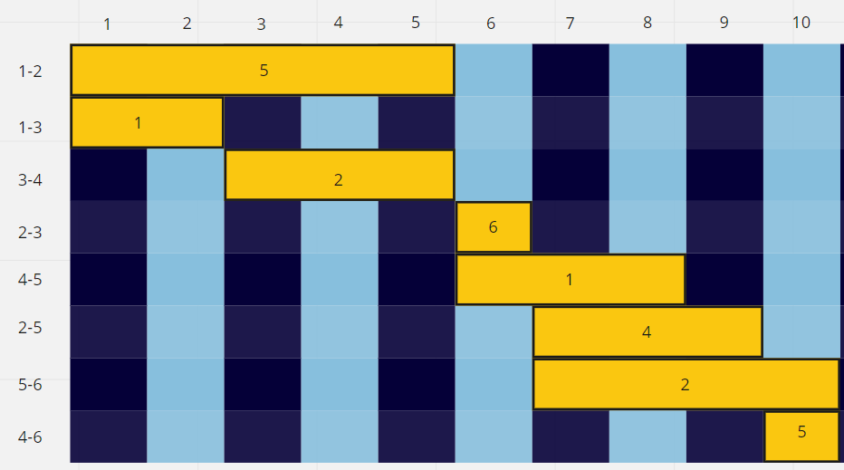

# Сетевая диограмма
### Задача
Построить сетевую диаграмму, оптимизировать по времени, максимальное количество человек которые можно использовать - 7

|Шифр работ|t, дни|Q, человек|
|----------|------|----------|
|1-2       |5     |5         |
|1-3       |2     |1         |
|2-3       |1     |6         |
|2-5       |3     |4         |
|3-4       |3     |2         |
|4-5       |3     |1         |
|4-6       |1     |5         |
|5-6       |4     |2         |

### Сетевая диаграмма

### Оптимизация по времени

Как можно видеть по диаграмме, все работы можно выполнить за 10 дней, при этом сумма работников в каждый день не превышает 7 человек.
